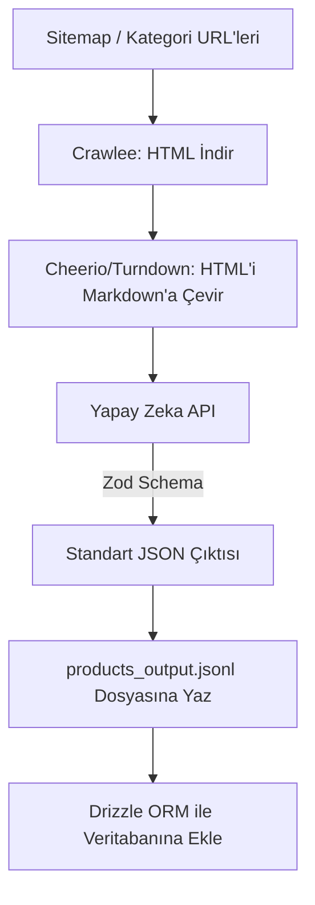

# Universal AI-Powered Scraper Planı (50+ Site İçin)

Projenin `scraper/` dizininde, 50 farklı çiçek satış sitesini tarayıp, farklı HTML ve kategori yapılarına sahip sitelerdeki verileri **Yapay Zeka (LLM)** kullanarak kendi standart veritabanı yapımıza (Drizzle ORM) uygun hale getirecek devasa bir sistem kuruyoruz.

## Mimari Yaklaşım

50 farklı site için ayrı ayrı CSS selector (`.title`, `.price_box` vb.) yazmak imkansız ve yönetilemezdir. Bu nedenle "AI-Powered Universal Extraction" mimarisi kullanacağız.

1. **Crawlee (Apify SDK):** Sitelere istek atmak, sitemap'leri bulmak, kuyruk (queue) yönetimini sağlamak ve engellemeleri (rate limit) aşmak için endüstri standardı olan Crawlee kütüphanesini kullanacağız.
2. **HTML to Markdown:** Crawlee'nin çektiği ham HTML sayfasını LLM'e göndermek çok maliyetli (token israfı) olacağı için, HTML'i önce temizleyip Markdown formatına (sadece metinler, linkler ve resimler kalacak şekilde) dönüştüreceğiz.
3. **AI Structured Output (Vercel AI SDK + Zod):** Temizlenmiş içeriği yapay zekaya (örn. Gemini veya OpenAI) verip, `Zod` (şema doğrulama) ile **"Bu sayfadaki ürünü bizim standart veritabanı modelimize uygun bir JSON olarak geri ver"** diyeceğiz. LLM, kategorileri (örn: karşı sitenin "Anneye Hediye"sini bizim "mother_day" tag'imizle) akıllıca eşleştirecek.

## Akış (Pipeline)



## Veri Şeması (LLM'den İstenecek Zod Yapısı)

Yapay zekanın bize her ürün sayfasından şu formattaki veriyi kesin olarak döndürmesini sağlayacağız (Veritabanınızdaki yapınıza tam uyumlu):

```typescript
import { z } from "zod";

export const ProductExtractionSchema = z.object({
  sku: z.string().describe("Ürünün karşı sitedeki benzersiz kodu"),
  name: z.string().describe("Ürün adı"),
  description: z.string().describe("Ürün açıklaması"),
  price: z.number().describe("Ürünün güncel satış fiyatı"),
  currency: z.string().describe("Para birimi (Örn: TRY)"),
  images: z.array(z.string()).describe("Ürünün yüksek çözünürlüklü görsel URL'leri"),
  
  // AI'ın akıllıca karar vereceği eşleştirmeler
  intentTags: z.array(z.enum([
    "dogum_gunu", "yeni_is", "yildonumu", "icimden_geldi", "gecmis_olsun", "kiz_isteme", "dugun_celenk"
  ])).describe("Bu çiçeğin gönderim amacı nedir? İçeriğe bakarak karar ver."),
  
  flowerTypes: z.array(z.enum([
    "gul", "papatya", "orkide", "lilyum", "sukulent", "karanfil"
  ])).describe("Ürün içerisindeki ana çiçek türleri neler?"),
  
  productType: z.enum(["bouquet", "vase", "box", "pot"]).describe("Ürünün sunum şekli (Buket, Vazo, Kutu, Saksı)")
});
```

## Geliştirme Adımları

1. **Scraper Projesi:** `scraper/` dizininde bağımsız bir Node.js TypeScript projesi başlatacağız (`package.json`, `tsconfig.json`).
2. **Kütüphaneler:** `crawlee`, `ai` (Vercel AI SDK), `@google/genai` (veya openai), `zod`, `turndown` kurulacak.
3. **AI Eşleştirme Motoru:** LLM'e veritabanımızda hangi kategorilerin ve etiketlerin olduğunu belirten detaylı bir Sistem Prompt'u yazacağız.
4. **Site Listesi:** Sadece başlangıç URL'lerini verdiğimiz bir JSON dosyasından okuyup tüm siteleri gezecek sistemi kuracağız.
5. **Veritabanı Aktarımı:** Çıkan JSON dosyasını okuyup veritabanına basacak bir script yazacağız.
